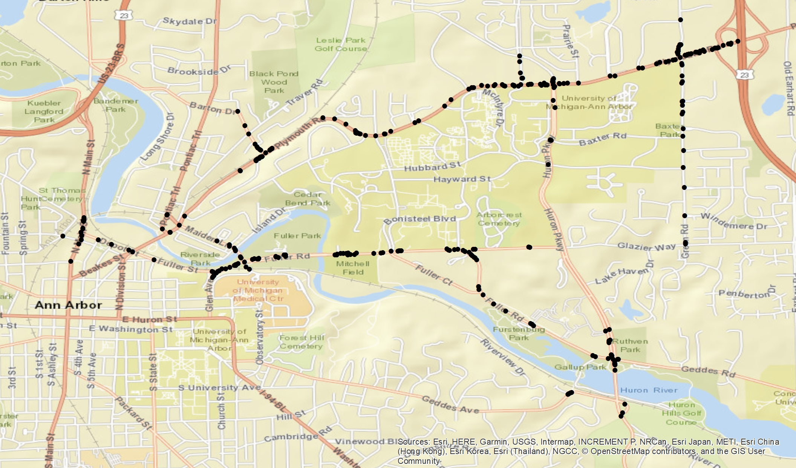
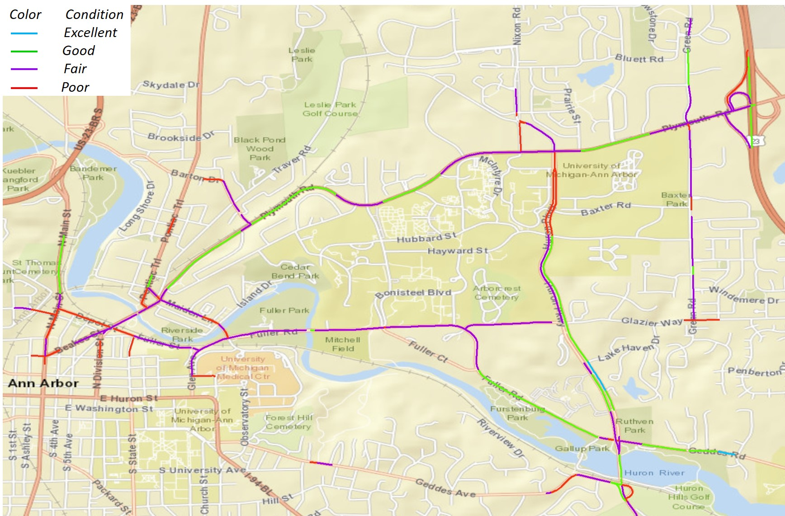

# Pothole-detection-with-connected-vehicle

This project describes an innovative method for detecting potholes and assessing road roughness based on data from the connected vehicles (CVs).  In the CVs system, vehicles transmit onboard diagnostic (OBD) data to roadside equipment (RSE) via dedicated short-range communication (DSRC) technology. The actual basic safety messages (BSM) collected by USDOT safety pilot CV program at 10 Hz in Detroit area was analyzed using support vector machine (SVM) and DBSCAN clustering algorithm. The analysis results show that the pothole detection accuracy can get up to 99.83% and the roughness classification accuracy based on four levels of PASER system is 85.12%. 

